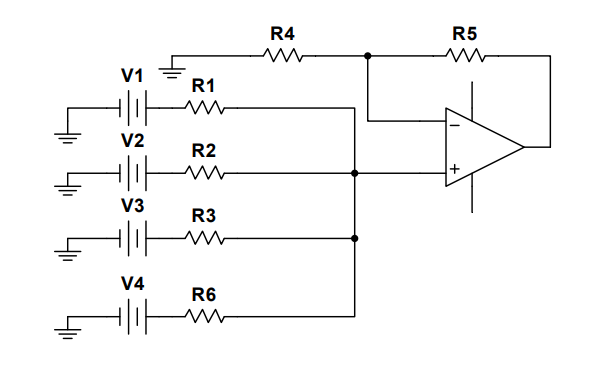
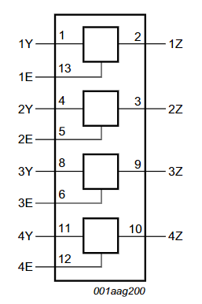
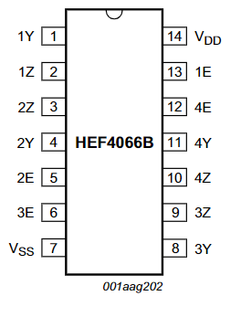
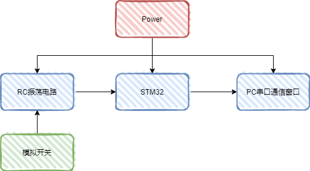
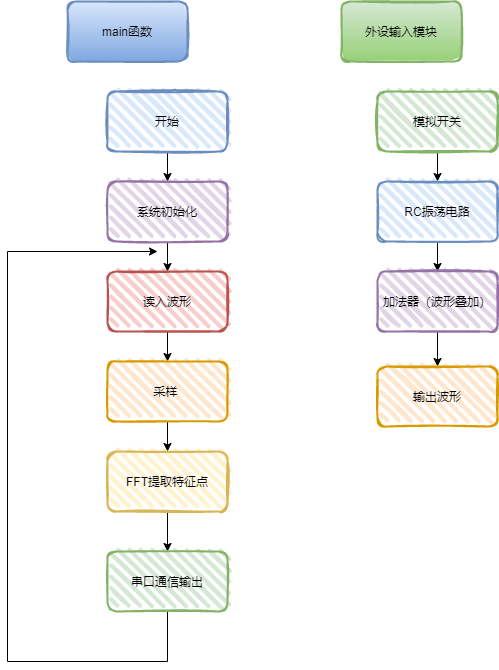
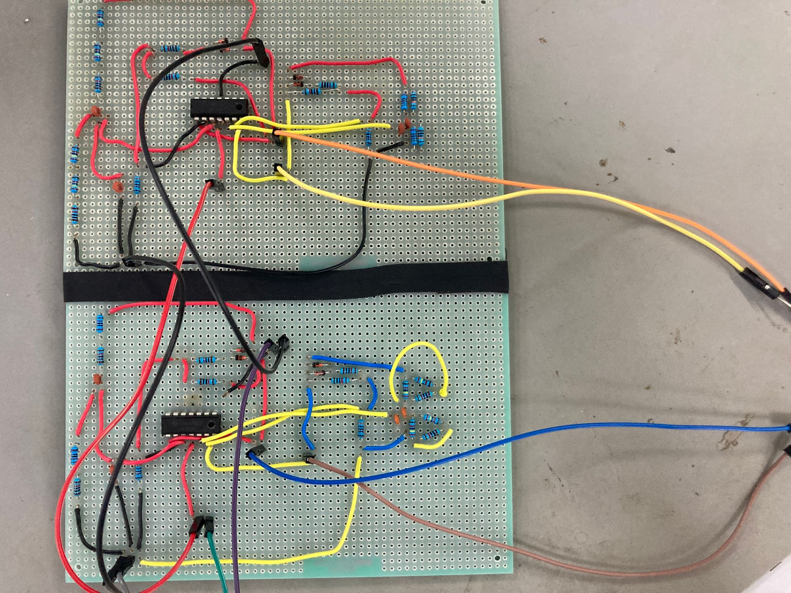
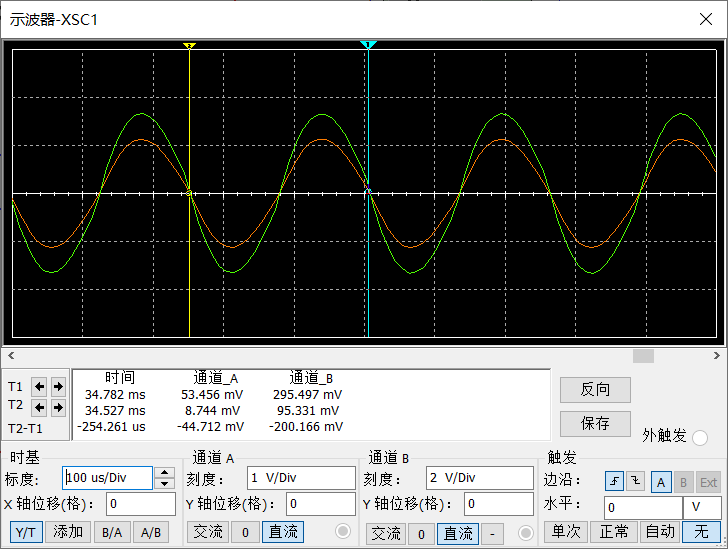
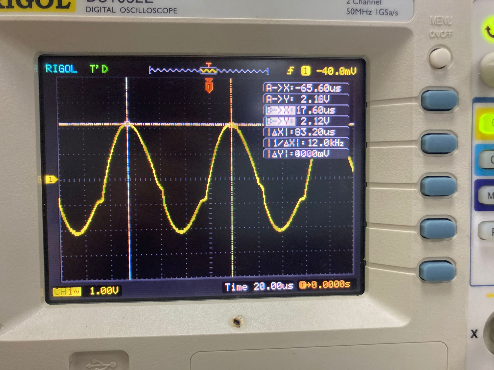
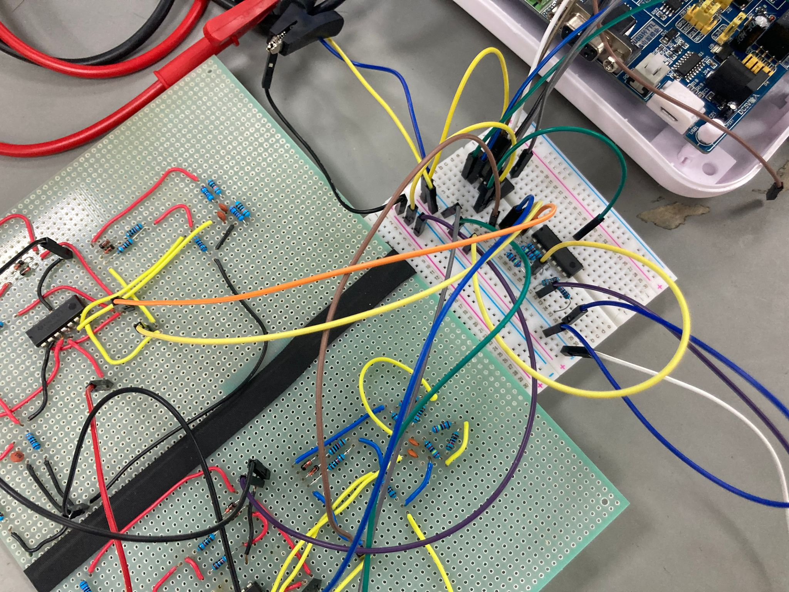
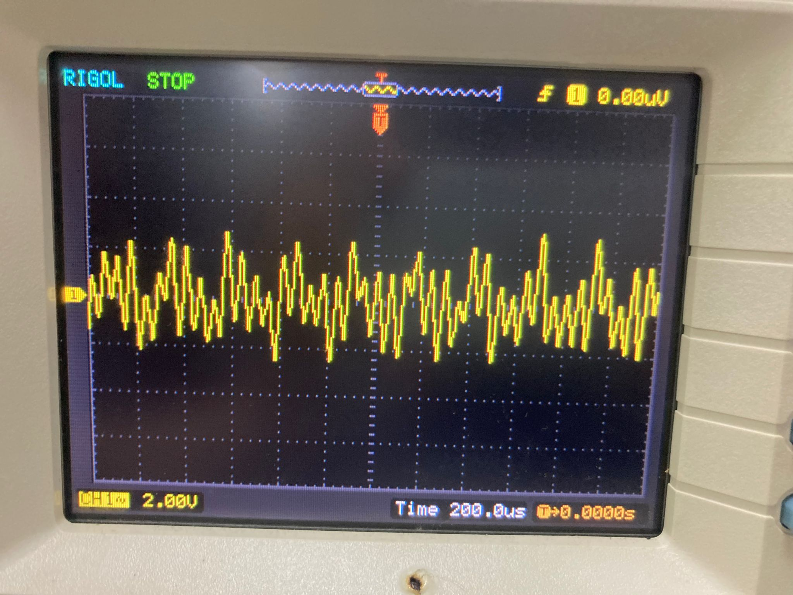

    

         
        
    

         
    

        
	

            
    《多频点合成模拟信号数据传输系统实验报告》
     
     
    <table style="border:none;text-align:center;width:72%;font-family:仿宋;font-size:14px; margin: 0 auto;">
    <tbody style="font-family:方正公文仿宋;font-size:12pt;">
    	<tr style="font-weight:normal;"> 
    	  </tr>
    	<tr style="font-weight:normal;"> 
    		<td style="width:20%;text-align:right;">授课教师</td>
    		<td style="width:2%">：</td> 
    		<td style="width:40%;font-weight:normal;border-bottom: 1px solid;text-align:center;font-family:华文仿宋">王酉  杨江</td>     </tr>
    	<tr style="font-weight:normal;"> 
    		<td style="width:20%;text-align:right;">成员姓名</td>
    		<td style="width:2%">：</td> 
    		<td style="width:40%;font-weight:normal;border-bottom: 1px solid;text-align:center;font-family:华文仿宋"> 郭嘉哲  3190101002   </td>     </tr>
        <tr style="font-weight:normal;"> 
    		<td style="width:20%;text-align:right;">成员姓名</td>
    		<td style="width:2%">：</td> 
    		<td style="width:40%;font-weight:normal;border-bottom: 1px solid;text-align:center;font-family:华文仿宋"> 梁毅浩 3190104716   </td>     </tr>
        <tr style="font-weight:normal;"> 
    		<td style="width:20%;text-align:right;">成员姓名</td>
    		<td style="width:2%">：</td> 
    		<td style="width:40%;font-weight:normal;border-bottom: 1px solid;text-align:center;font-family:华文仿宋"> 余丛杉 3190103165  </td>     </tr> 

​    

<!-- 注释语句：导出PDF时会在这里分页 -->

摘　要：
 

多频点合成模拟信号数据传输，我们选择4kHz，8kHz，12kHz，16kHz频点进行传输，并与需传输的数据进行逐位相乘，叠加合成信号，再由stm32进行AD采样，获得合成信号的特征点，经过FFT解调，得到出现峰峰值的频率点，由此可得传输的信号。整个实验可分为波形发生模块、波形叠加模块、波形AD采样、FFT快速傅里叶模块、通信传输模块。分别实现各个模块并确认运行正常后，我们对系统进行整体测试。

## 实验要求

+ 实现一个用 4~20kHz 频带内的多频点（≥4，频点频率及频点个数均可选，但频率需为 kHz 的整数倍）合成模拟信号进行数字比特流传输的系统；

+ 要求能实现 32 比特或 32 比特整数倍（最多不超过 32*5=160 比特）的二进制数据传输；

+ 指标有总传输比特数、传输时间、 误码率、信道衰减倍数、信噪比等。 MCU、FPGA 开发板自备；

+ 使用器件为常规器件（接插件、电阻、电容、电位器）以及如下运放芯片：LM324、OP07、OP27、OP37。不允许使用其他器件

+ 基本要求

  在不进行信道衰减和噪声叠加的情况下完成系统功能。

+ 发挥部分

  在一定的信道衰减和噪声叠加后完成系统功能。注意以降低误码率为最终目的的前提下 有取舍地提高衰减倍数和叠加噪声强度。

  

## 实验设备

+ STM32F103RCT6核心板
+ 电阻
+ LM324芯片
+ HEF4066B芯片
+ 面包板
+ PC机
+ keil软件

## 实验原理　　

​	多频点信号指多个单频正弦信号的合成（合成后的信号电压峰峰值在3~5V），其中每个正弦信号会乘上一个系数（0或1）。我们选择4kHz，8kHz，12kHz，16kHz频点进行传输，要传输的数据为1010(B)，则应把一个4kHz正弦波和12kHz正弦波合成，8kHz和12kHz信号乘上的系数是0，不参与合成。再由stm32进行AD采样获得合成波形的特征点，经过FFT解调，得到在两个频率点下出现峰峰值——4kHz和12kHz，由此可得传输的信号为1010(B).

### 波形发生模块

#### 硬件实现

​	采用RC振荡器 - 文氏电桥振荡器，电路原理图如下所示：

<strong>图 1  RC振荡器原理图 </strong>

#### 软件实现

​	我们在老师的建议下，并参考相关例程，采用开发板上的DMA模块和DAC模块作为正弦波波形的发生器。具体步骤为：

+ 用matlab计算获取正弦波数据表；
+ 根据正弦波数据表的周期内点数和周期计算定时器触发间隔；
+ 初始化 DAC 输出通道，初始化 DAC 工作模式；
+ 配置触发 DAC 用的定时器，根据频率选择定时器中断触发的时间；
+ 配置 DMA 自动转运正弦波数据表.

​	但由于板子和外设DA模块都无法在短时间获得，我们果断放弃此方案，采用硬件实现。

### 波形叠加模块

#### 加法电路

​	电路原理图：

​	                                       

<strong>图 2  加法电路原理图 </strong>

​	三个输入信号同时加到运放同相端，当$R_1=R_2=R_3$时，其输入输出电压关系式为：
$$
V_o=\frac{1}4(V_1+V_2+V_3+V_4)(1+\frac{R_5}{R_4})
$$
我们再令$R_5=3R_4$​，则有
$$
V_o=V_1+V_2+V_3+V_4
$$

#### 选择模块

​	用CD4066四双向模拟开关进行选择控制，主要用作模拟或数字信号的多路传输。每个模拟开关有输入、输出、控制三个端子，其中输入端和输出端可互换.

​                                      

<strong>图 3  4066芯片管脚图 </strong>

### 波形采样——ADC模块

​	对波形进行采样，4$\mu s$采一个点，共采128个点。

​	ADC配置步骤：

+ 使能端口时钟和 ADC 时钟，设置引脚模式为模拟输入；
+ 设置 ADC 的分频因子；
+ 初始化 ADC 参数，包括 ADC 工作模式、规则序列等；
+ 使能 ADC 并校准；
+ 读取 ADC 转换.

### 快速傅里叶变换(ftt)	

#### FFT原理

​	FFT是一种DFT的高校算法，称为快速傅里叶变换。FFT算法可分为按时间抽取算法和按频率抽取算法。

​	DFT运算：
$$
X(k)=DFT[x(n)]=\sum^{N-1}_{n=0}x(n)W_N^{kn}, k=0,1,...,N-1
$$

$$
x(n)=IDFT[X(k)]=\sum_{k=0}^{N-1}X(k)W_N^{-kn}, n=0,1,...,N-1
$$

式中$W_N=e^{-j\frac{2\pi}{N}}$

由这种方法计算DFT对于X（K）的每个K值，需要进行4N次实数相乘和（4N-2）次相加，对于N个k值，共需N*N乘和N（4N-2）次实数相加。改进DFT算法，减小它的运算量，利用DFT中$W_N^{kn}$​的周期性和对称性，使整个DFT的计算变成一系列迭代运算，可大幅度提高运算过程和运算量，这是FFT的基本思想。

#### 	c语言实现FFT

+ 将输入信号的实部和虚部分别赋值给数组
+ 将$w=e^{-j2\frac{\pi}{n}}$用欧拉公式表示
+ 蝴蝶操作

### 通信模块

​	DMA，全称是 Direct Memory Access. DMA 可用于实现外设与存储器之间或者存储器与存储器之间数据传输的高效性。之所以称为高效，是因为 DMA 传输数据移动过程无需 CPU 直接操作，这样节省的 CPU 资源就可供其它操作使用。从硬件层面来理解，DMA 就好像是 RAM 与 I/O 设备间数据传输的通路，外设与存储器之间或者存储器与存储器之间可以直接在这条通路上进行数据传输。这里说的外设一般指外设的数据存器，比如ADC、SPI、I2C、 DCMI等外设的数据寄存器，存储器一般是指片内 SRAM、外部存储器、片内 Flash等。

​	配置步骤：

+ 使能DMA控制器（DMA1或DMA2）时钟
+ 初始化DMA通道，包括配置通道、外设和内存地址、传输数据量等。
+ 使能外设DMA功能（DMA请求映射图对应的外设）
+ 开启DMA的通信传输
+ 查询DMA传输状态

## 系统框图

<strong>图4 系统框图 </strong>

## 流程图

<strong>图5  流程图 </strong>

## 实验内容

### 波形发生&叠加模块

​	根据原理焊接、调试硬件

​	电阻电容选择：

+ 3kHz
  + 电阻$R=58k\Omega$
  + 电容$C=680pF$
+ 6kHz
  + 电阻$R=30k\Omega$
  + 电容$C=680pF$
+ 12kHz
  + 电阻$R=20k\Omega$​
  + 电容$C=680pF$
+ 15kHz
  + 电阻$R=21.4k\Omega$​
  + 电容$C=4700pF$​

<strong>图6   波形发生装置 </strong>

### 波形采样模块

+ 用`TIM4`定时器每隔4$\mu s$进行一次采样；

+ 采128个点后结束采样

+ 具体用`Get_ADC_Value(u8 ch, u8 times)`进行读取，完成模数转换。

### FFT变换

+ 封装`kfft()`函数进行FFT变换;

+ 输入形参说明：

  
<strong>表 1  函数参数说明 </strong>

  | 形参与函数类型 | 参数                                           |
  | -------------- | ---------------------------------------------- |
  | double pr[n]   | 存放n个采样输入的实部,return离散傅里叶变换的模 |
  | double pi[n]   | 存放n个采样输入的虚部                          |
  | double fr[n]   | return离散傅里叶变换的n个实部                  |
  | double fi[n]   | return离散傅里叶变换的n个虚部                  |
  | int n          | 采样点数                                       |
  | int k          | 满足$n=2^k$                                    |
  | void kfft()    | 过程                                           |

### 通信模块

+ 封装`SendFunction(u8 p[])`函数进行传输;
+ 由于DMA函数输出的数据类型为`char`，故需在传输前进行数据类型转换，对此我们封装了`typeConvert(u8 sendvalue4[], u8 len)`函数进行数据类型转换。

## 测试结果

### 波形发生

#### 仿真波形

<strong>图7   仿真波形 </strong>

#### 实际波形

​                              

​                          

<strong>图8    波形发生4kHz 8Hz 12Hz 16Hz </strong>

​	波形发生电路自激振荡产生的正弦波较稳定，频率较目标值误差小。

### 波形叠加

​                                  

<strong>图9    波形叠加装置和波形叠加结果 </strong>

​	波形叠加用LM324芯片实现，搭建加法电路，加法电路可以正常使用。但由于波形发生器产生的正弦波幅值偏大（在3伏附近)，叠加后会产生波形失真，我们采用衰减电路缩小幅值。

​	信号频率的选择用HEF4066B模拟开关实现，模拟开关的控制端、输入输出端功能正常，此控制端为高电平有效的控制信号端可以正常使用。用单片机GPIO write对控制端输出高低电平，从而实现信号频率的选择，但我们发现无法按预期进行选择。在排查问题时，我们发现GPIO可以根据程序输出高低电平：3.3V和0V，但控制端始终为使能状态，在老师的点拨下，我们得知控制端的使能电压需与供电高电平一致，关断电压需与供电低电平一致。但由于我们模拟开关只能输送供电电压范围内的电信号，即-3V\~3V之间（正弦信号），需有负数成分，但stm32的GPIO口无法输出负电压，我们采用0\~3V供电，虽然只能传输正信号，但丢失的负电压信号不影响FFT的计算。最终因为杂波太多，芯片也无法替换（芯片数量有限），放弃了模拟开关。

### FFT模块&发送模块

​	ADC采样正常，再由stm32程序用FFT计算出的结果和matlab中`fft()`函数计算结果一致，通过串口输出4位数据，功能正常。

### 通信模块

​	用`USART`可以发送32位数据，可以正常输出，并能对数据进行拆分，通过GPIO write控制模拟开关。

